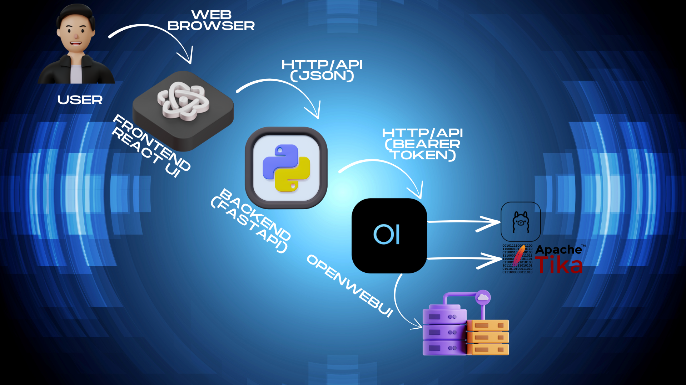

# 🏛️ University AI Assistant

Welcome to our university’s very own self-hosted AI assistant! This project combines modern open-source AI tooling to give our staff and students a secure, private, and extremely helpful “ChatGPT-style” assistant that *knows* our internal documentation (even those old PDFs with questionable scan quality...).

This assistant can:
- Answer questions from our HR/policy PDFs, onboarding documents, legal texts, and more.
- Use **OCR** (optical character recognition) so even scanned/photographed documents become part of its knowledge base.
- Be run entirely **within our university’s intranet**—no cloud, no data leaks, no excuses!
- Scale as our university’s documentation grows, with easy updates and bulk ingestion.

> **Everything is built by and for our university team. You’re not just a user—you’re a co-creator!**

---

## 🗂️ Project Structure

Here’s how the repository is organized. This structure makes it easy for developers to find what they need and for future contributors to not lose their sanity.

```
UHH-AI/
├── backend/
│   ├── main.py
│   ├── requirements.txt
│   ├── config.py
│   ├── api/
│   │   ├── routes.py
│   │   └── openwebui_client.py
│   ├── services/
│   │   ├── chat_service.py
│   │   └── document_service.py
│   ├── scripts/
│   │   └── initial_ingest.py   # Bulk-ingest PDFs into OpenWebUI
│   └── utils/
│       └── logger.py
│
├── frontend/
│   ├── public/
│   │   └── index.html
│   ├── src/
│   │   ├── App.tsx
│   │   ├── index.tsx
│   │   ├── components/
│   │   │   ├── ChatWindow.tsx
│   │   │   ├── MessageBubble.tsx
│   │   │   ├── UploadArea.tsx
│   │   │   └── Navbar.tsx
│   │   └── services/
│   │       └── api.ts
│   ├── package.json
│   └── tsconfig.json
│
├── docs/
│   ├── architecture.png
│   └── IMPLEMENTATION_GUIDE.md
│
├── docker-compose.yml
├── .env.example
└── README.md
```

---

## 🧩 How Everything Connects (Architecture Overview)

### Diagram



**Explanation of the Flow:**

1. **User** (staff/student) opens a browser and visits the AI Assistant web page on the intranet.
2. The **React frontend** (our beautiful UI) allows users to:
    - Ask questions in a chat-like interface.
    - Upload PDFs (policies, contracts, onboarding docs—bring ’em all).
3. Frontend sends chat/file requests to our **Python FastAPI backend**, which acts as the “bouncer” and business logic layer.
4. Backend uses the **OpenWebUI API** (running in its own Docker container) to:
    - Send user questions (and, if needed, tell the AI to use certain uploaded PDFs as “context” for answers).
    - Upload and index new documents.
5. **OpenWebUI** is the real “AI orchestrator”:
    - Calls **Ollama** for local language model inference (e.g., LLaMA-2).
    - When a new PDF is uploaded, passes it to **Apache Tika** for OCR/text extraction.
    - Splits the text into “chunks,” embeds them for search, and stores them in its internal **vector database (Chroma)**.
    - When a user asks a question, does a semantic search over these embeddings to find the most relevant info (“RAG”: retrieval-augmented generation), and passes it to the LLM for an answer.
6. The **answer** travels back up the chain (OpenWebUI → backend → frontend → user).
7. The whole system runs entirely on university-owned servers. Data never leaves our campus!

---

## 🛠️ Tech Stack

- **Frontend:** React + TypeScript + Tailwind CSS
- **Backend:** Python (FastAPI)
- **AI Engine:** OpenWebUI (containerized)
- **Local LLM:** Ollama (with LLaMA-2 or similar models)
- **OCR:** Apache Tika
- **Vector DB:** Chroma (managed by OpenWebUI)
- **Containerization:** Docker & Docker Compose
- **Bulk PDF Ingestion:** Python script (`backend/scripts/initial_ingest.py`)
- **Documentation:** Markdown (docs/), inline code comments

---

## 🚀 Quickstart (Getting it Running)

### 1. Clone the Repo

```bash
git clone https://github.com/AyhamJo7/UHH-AI.git
```

### 2. Copy & Edit Environment Config

```bash
cp .env.example .env
```

Set your OpenWebUI API key, base URLs, etc. in the `.env` file.

### 3. Bulk-Upload PDFs (once)

- Place your PDFs in a local folder (see `IMPLEMENTATION_GUIDE.md` for naming tips).
- Run:

```bash
python backend/scripts/initial_ingest.py
```

> ⚠️ Only do this once per PDF! Script logs uploads and skips already-uploaded docs.

### 4. Start Everything

```bash
docker-compose up -d
```

This will launch backend, frontend, OpenWebUI, Ollama, and Tika—all networked together.

### 5. Use It!

- Go to the web page (usually [http://localhost:5000](http://localhost:5000) or whatever port you mapped).
- Start chatting, upload docs, and let the AI do the rest!

---

## 🧑‍💻 For Developers

- Want to develop the backend?  
  See `docs/IMPLEMENTATION_GUIDE.md` for file-by-file explanations, API call samples, and dev tips.

- Frontend changes?  
  Just edit React components, run `npm start` in `frontend/`, and see changes live.

- Extending with more AI models, or want to improve OCR?  
  There are notes in the implementation guide!

---

## 🤝 Thanks!

Big thanks to all team members who contribute, test, or bring snacks to late-night coding sessions.  
You make this campus project work!
